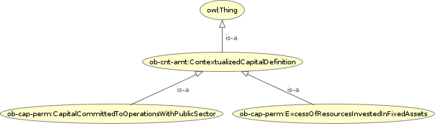

<h2>PermanentLimit</h2>
<h3>https://ontobacen.web.app/Capital/PermanentLimit/ 
</h3>

<h4>References</h4>

<ul>
<li>
<a href='https://github.com/filipepolizel/ontobacen/blob/master/public/Capital/PermanentLimit/OWLDoc/classes/index-PermanentLimit.html' >Classes</a> (5)
</li>
<li>
<a href='https://github.com/filipepolizel/ontobacen/blob/master/public/Capital/PermanentLimit/OWLDoc/annotationproperties/index-PermanentLimit.html' >Annotation Properties</a> (2)
</li>
<li>
<a href='https://github.com/filipepolizel/ontobacen/blob/master/public/Capital/PermanentLimit/OWLDoc/datatypes/index-PermanentLimit.html' >Datatypes</a> (2)
</li>
</ul>

<!-- permanentlimit -->

<h4>Imports (1)</h4>

<ul>
<li class="asserted">https://ontobacen.web.app/Capital/PermanentLimit/ 
</li>
</ul>

<!-- imports (1) -->

 <!-- summary -->

<a href='http://code.google.com/p/ontology-browser/' target='_blank'>OWL HTML inside</a>

