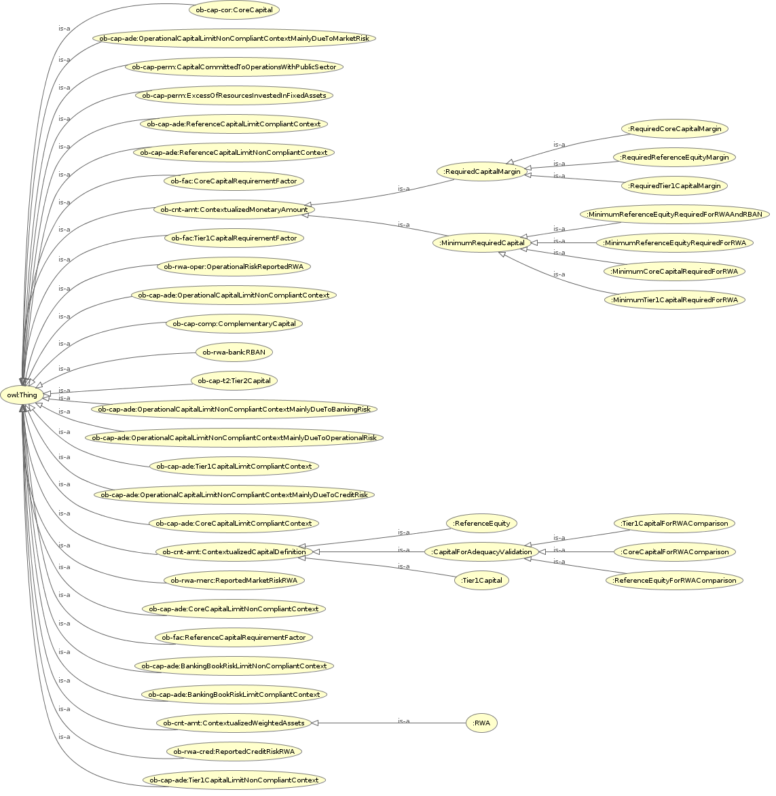

<h2>CapitalRequirements</h2>
<h3>https://ontobacen.web.app/CapitalRequirements/ 
</h3>

<h4>References</h4>

<ul>
<li>
<a href='https://htmlpreview.github.io/?https://github.com/filipepolizel/ontobacen/blob/master/public/CapitalRequirements/OWLDoc/classes/index-CapitalRequirements.html' >Classes</a> (46)
</li>
<li>
<a href='https://htmlpreview.github.io/?https://github.com/filipepolizel/ontobacen/blob/master/public/CapitalRequirements/OWLDoc/objectproperties/index-CapitalRequirements.html' >Object Properties</a> (31)
</li>
<li>
<a href='https://htmlpreview.github.io/?https://github.com/filipepolizel/ontobacen/blob/master/public/CapitalRequirements/OWLDoc/dataproperties/index-CapitalRequirements.html' >Data Properties</a> (4)
</li>
<li>
<a href='https://htmlpreview.github.io/?https://github.com/filipepolizel/ontobacen/blob/master/public/CapitalRequirements/OWLDoc/annotationproperties/index-CapitalRequirements.html' >Annotation Properties</a> (1)
</li>
<li>
<a href='https://htmlpreview.github.io/?https://github.com/filipepolizel/ontobacen/blob/master/public/CapitalRequirements/OWLDoc/datatypes/index-CapitalRequirements.html' >Datatypes</a> (3)
</li>
</ul>

<!-- capitalrequirements -->

<h4>Imports (14)</h4>

<ul>
<li class="asserted">https://ontobacen.web.app/Capital/PermanentLimit/ 
</li>
<li class="asserted">https://ontobacen.web.app/Capital/Tier1Complementary/ 
</li>
<li class="asserted">https://ontobacen.web.app/Capital/Tier1Core/ 
</li>
<li class="asserted">https://ontobacen.web.app/Capital/Tier2/ 
</li>
<li class="asserted">https://ontobacen.web.app/Foundations/CapitalAdequacy/ 
</li>
<li class="asserted">https://ontobacen.web.app/Foundations/ContextualizedMonetaryAmount/ 
</li>
<li class="asserted">https://ontobacen.web.app/Foundations/Factors/ 
</li>
<li class="asserted">https://ontobacen.web.app/Foundations/Relations/ 
</li>
<li class="asserted">https://ontobacen.web.app/RWA/BankingRisk/ 
</li>
<li class="asserted">https://ontobacen.web.app/RWA/CreditRisk/ 
</li>
<li class="asserted">https://ontobacen.web.app/RWA/MarketRisk/ 
</li>
<li class="asserted">https://ontobacen.web.app/RWA/OperationalRisk/ 
</li>
<li class="asserted">https://spec.edmcouncil.org/fibo/ontology/FND/Accounting/CurrencyAmount/ 
</li>
<li class="asserted">https://spec.edmcouncil.org/fibo/ontology/FND/Relations/Relations/ 
</li>
</ul>

<!-- imports (14) -->

 <!-- summary -->

<a href='http://code.google.com/p/ontology-browser/' target='_blank'>OWL HTML inside</a>

</body>
</html>
