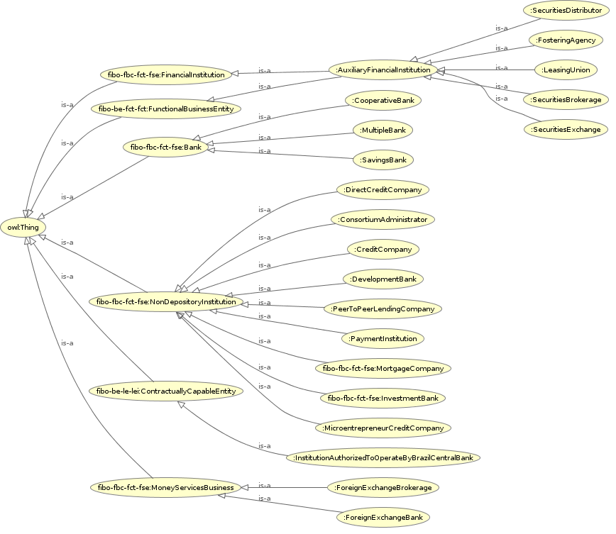

<h2>FinancialInstitutions</h2>
<h3>https://ontobacen.web.app/Foundations/FinancialInstitutions/ 
</h3>

<h4>References</h4>

<ul>
<li>
<a href='https://htmlpreview.github.io/?https://github.com/filipepolizel/ontobacen/blob/master/public/Foundations/Factors/OWLDoc/classes/index-FinancialInstitutions.html' >Classes</a> (29)
</li>
<li>
<a href='https://htmlpreview.github.io/?https://github.com/filipepolizel/ontobacen/blob/master/public/Foundations/Factors/OWLDoc/objectproperties/index-FinancialInstitutions.html' >Object Properties</a> (2)
</li>
<li>
<a href='https://htmlpreview.github.io/?https://github.com/filipepolizel/ontobacen/blob/master/public/Foundations/Factors/OWLDoc/dataproperties/index-FinancialInstitutions.html' >Data Properties</a> (2)
</li>
<li>
<a href='https://htmlpreview.github.io/?https://github.com/filipepolizel/ontobacen/blob/master/public/Foundations/Factors/OWLDoc/annotationproperties/index-FinancialInstitutions.html' >Annotation Properties</a> (5)
</li>
<li>
<a href='https://htmlpreview.github.io/?https://github.com/filipepolizel/ontobacen/blob/master/public/Foundations/Factors/OWLDoc/datatypes/index-FinancialInstitutions.html' >Datatypes</a> (2)
</li>
</ul>

<!-- financialinstitutions -->

<h4>Imports (1)</h4>

<ul>
<li class="asserted">https://spec.edmcouncil.org/fibo/ontology/master/2021Q1/FBC/FunctionalEntities/FinancialServicesEntities/ 
</li>
</ul>

<!-- imports (1) -->

 <!-- summary -->

<a href='http://code.google.com/p/ontology-browser/' target='_blank'>OWL HTML inside</a>

