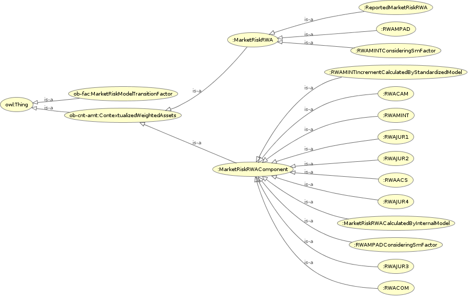

<h2>MarketRisk</h2>
<h3>https://ontobacen.web.app/RWA/MarketRisk/ 
</h3>

<h4>References</h4>

<ul>
<li>
<a href='https://htmlpreview.github.io/?https://github.com/filipepolizel/ontobacen/blob/master/public/RWA/MarketRisk/OWLDoc/classes/index-MarketRisk.html' >Classes</a> (20)
</li>
<li>
<a href='https://htmlpreview.github.io/?https://github.com/filipepolizel/ontobacen/blob/master/public/RWA/MarketRisk/OWLDoc/objectproperties/index-MarketRisk.html' >Object Properties</a> (20)
</li>
<li>
<a href='https://htmlpreview.github.io/?https://github.com/filipepolizel/ontobacen/blob/master/public/RWA/MarketRisk/OWLDoc/dataproperties/index-MarketRisk.html' >Data Properties</a> (4)
</li>
<li>
<a href='https://htmlpreview.github.io/?https://github.com/filipepolizel/ontobacen/blob/master/public/RWA/MarketRisk/OWLDoc/annotationproperties/index-MarketRisk.html' >Annotation Properties</a> (1)
</li>
<li>
<a href='https://htmlpreview.github.io/?https://github.com/filipepolizel/ontobacen/blob/master/public/RWA/MarketRisk/OWLDoc/datatypes/index-MarketRisk.html' >Datatypes</a> (2)
</li>
</ul>

<!-- marketrisk -->

<h4>Imports (5)</h4>

<ul>
<li class="asserted">https://ontobacen.web.app/Foundations/ContextualizedMonetaryAmount/ 
</li>
<li class="asserted">https://ontobacen.web.app/Foundations/Factors/ 
</li>
<li class="asserted">https://ontobacen.web.app/Foundations/Relations/ 
</li>
<li class="asserted">https://spec.edmcouncil.org/fibo/ontology/FND/Accounting/CurrencyAmount/ 
</li>
<li class="asserted">https://spec.edmcouncil.org/fibo/ontology/FND/Relations/Relations/ 
</li>
</ul>

<!-- imports (5) -->

 <!-- summary -->

<a href='http://code.google.com/p/ontology-browser/' target='_blank'>OWL HTML inside</a>

